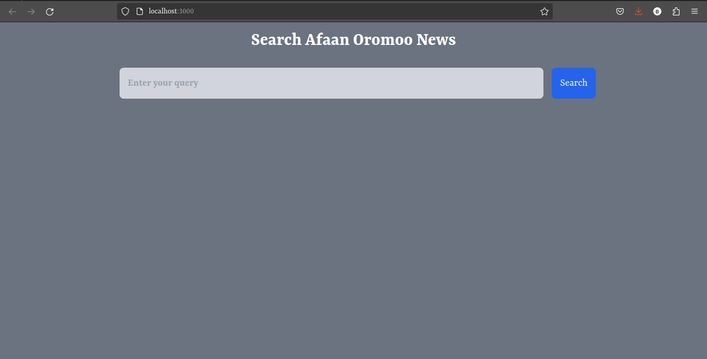
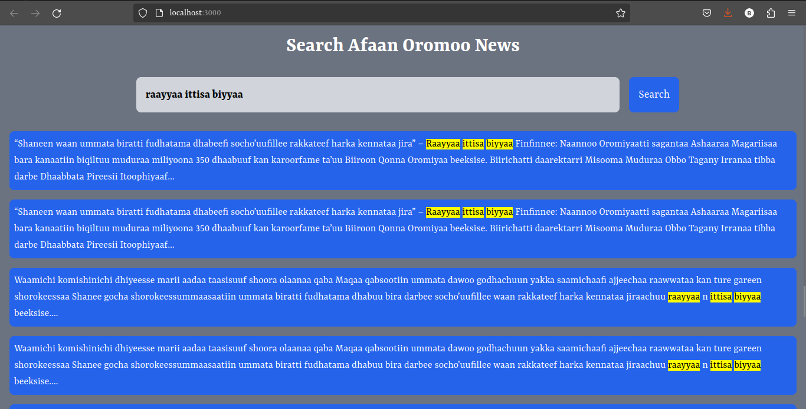
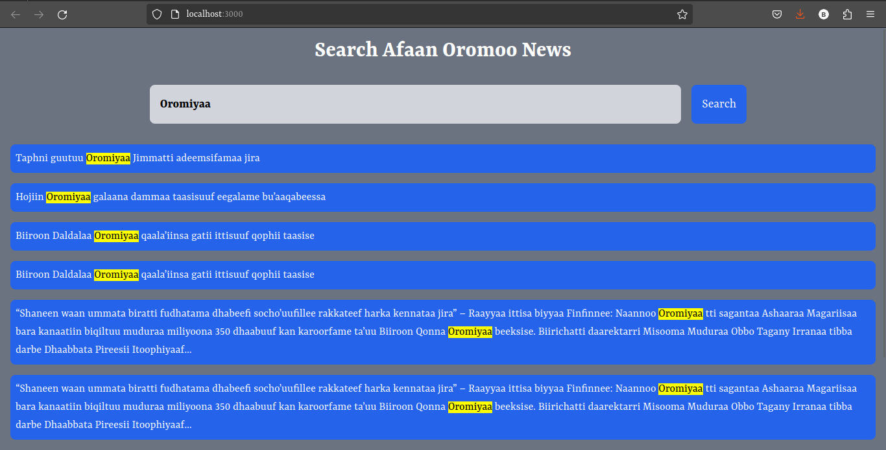
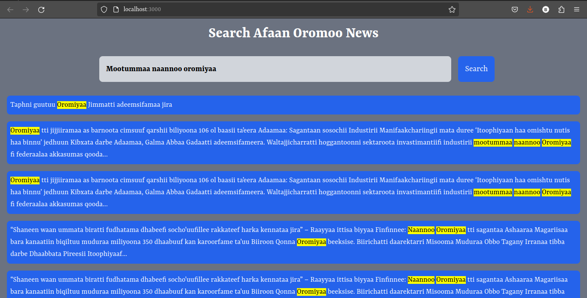
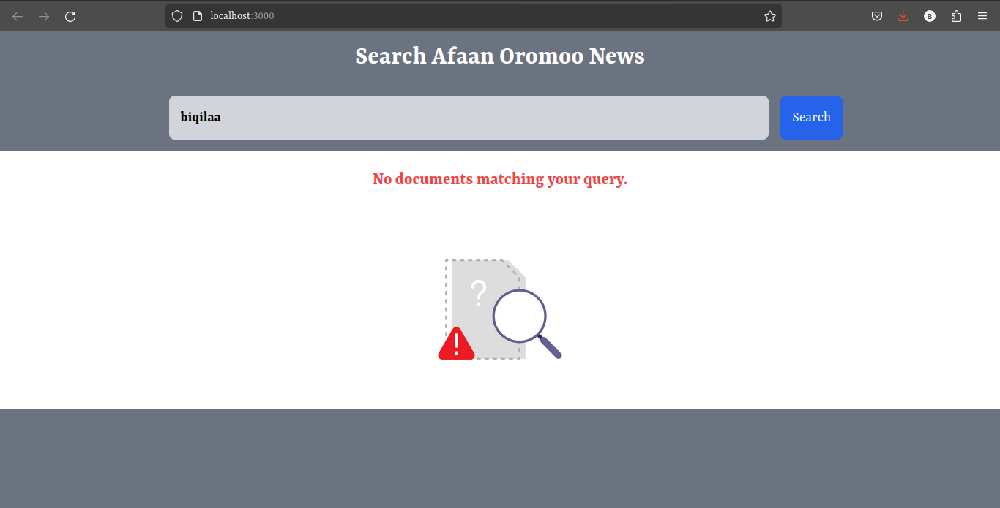

# IR Assignment - Afaan Oromoo news Retrieval System

🔍 **Overview:**

This project implements basic Information Storage and Retrieval concepts for Afaan Oromoo news. It preprocesses the corpus and queries, indexes the data, measures similarity, and ranks the results. Additionally, it provides a simple and interactive interface for querying the system.

🚀 **Features:**

- **Preprocessing:** 
  - The system preprocesses both the corpus and user queries before indexing. 

- **Indexing:** 
  - It creates an index of the corpus, allowing for efficient retrieval of documents based on queries.

- **Similarity Measure:** 
  - The system employs similarity measures to determine the relevance of documents to a given query.

- **Ranking:** 
  - It ranks the retrieved documents based on their relevance to the query.

- **Interactive Interface:** 
  - Provides a user-friendly interface for users to input queries and receive relevant documents.

  **Showing proper error:**
  - When there are no matching documents the system returns proper error message.

💡 **Additional Features (Bonus):**

- **Stemming:** 
  - While stemming is not included, the system supports its integration for further enhancement.

- **Snippet Generation:** 
  - Generates snippets of relevant sections from the retrieved documents for better context.

- **Query Term Highlighting:** 
  - Highlights the query terms within the generated snippets for improved readability.

💻 **Technologies Used:**

- React JS: Frontend development library.

📝 **Usage:**

1. Clone the repository.
2. Install dependencies using `npm install`.
3. Start the application using `npm start`.
4. Access the application via the provided URL.

📸 **Screenshots:**

📄 **License:**

This project is licensed under the MIT License - see the [LICENSE](LICENSE) file for details.

👥 **Contributors:**

- [Bikila Ketema](https://github.com/bikilaketema)

📅 **Due Date:**

This project is due three days after the end of finals(June 17,2024).

📧 **Contact:**

For any queries or assistance, please contact [bikilaketema94@gmail.com](mailto:bikilaketema94@gmail.com).

🌟 **Enjoy Exploring!**
